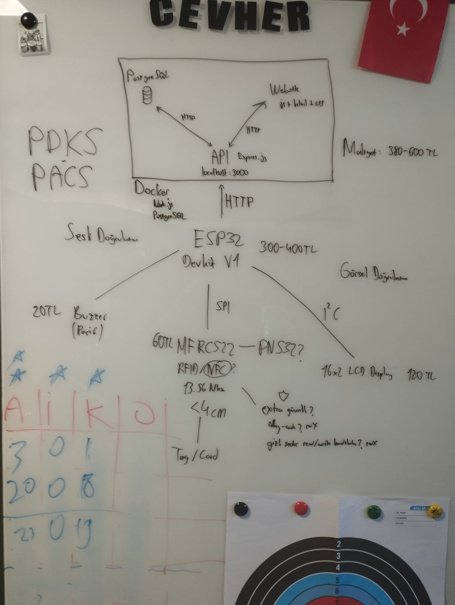

# Personnel Attendance Control System (PACS/PDKS)

A Personnel Attendance Control System (PACS/PDKS) built with **Node.js**, **Express.js**, **PostgreSQL**, and **Docker**.

---

## 🛠 Tech Stack

- **Frontend**: HTML, CSS, JavaScript
- **Backend**: Node.js, Express.js
- **Database**: PostgreSQL
- **Containerization**: Docker & Docker Compose
- **Hardware**: ESP32, MFRC522 RFID Reader, Buzzer, LiquidCrystal_I2C LCD

---

## 📁 Project Structure

```text
attendance-backend/
├── app/                  # Express REST API application
│   ├── index.js          # API endpoints & application logic
│   ├── Dockerfile        # Container definition for Node.js API
│   ├── package.json      # Dependencies and scripts
│   └── public/           # Static frontend files (HTML/CSS/JS)
├── PDKS.ino              # ESP32 firmware for RFID readers, WiFi connection, HTTP API calls, LCD & Buzzer
├── PDKS_Architecture.jpeg # Whiteboard system architecture diagram
├── db-init/              # PostgreSQL database initialization scripts
│   └── init.sql          # DB schema & seed data
├── docker-compose.yml    # Docker services orchestrator
├── .env.example          # Template environment variables
└── README.md             # Project documentation
```

---

## ⚡ Hardware Architecture & Components

The hardware subsystem is powered by an **ESP32 DevKit V1** microcontroller, which acts as the physical access terminal communicating with the Express backend API over **HTTP / Wi-Fi**.



### 🔌 Component Specifications & Wiring Protocols

| Component | Specification / Model | Communication Protocol | Purpose / Function |
| :--- | :--- | :--- | :--- |
| **Microcontroller** | **ESP32 DevKit V1** | Wi-Fi (HTTP requests) | Main controller; connects to local network, reads sensors, and sends HTTP requests to `/api/v1/request` on backend port `3000`. |
| **RFID Reader(s)** | **MFRC522** (or PN532) | **SPI** | Reads 13.56 MHz RFID/NFC cards/tags (< 4 cm range). Configured for dual Entry (`in`) and Exit (`out`) detection. |
| **Visual Display** | **16x2 LCD Display** | **I²C** (Address `0x27`) | Provides visual feedback (greetings, worker status, card read confirmation, error messages). |
| **Acoustic Alert** | **Passive Buzzer** | GPIO (Pin 15) | Provides audio feedback (beep sequences for valid scans, unknown cards, and registration modes). |

### 📊 Estimated Hardware Cost Breakdown

* **ESP32 DevKit V1**: ~300 – 400 TL
* **MFRC522 RFID Reader**: ~75 - 150 TL
* **16x2 I²C LCD Display**: ~120 TL
* **Passive Buzzer**: ~20 TL
* **Total Hardware Cost**: **~515 - 790 TL**

---

## 🚀 Quick Start

### 1. Prerequisites

- [Docker Desktop](https://www.docker.com/products/docker-desktop/) installed & running
- Node.js (v18+) (optional for local running)

### 2. Environment Setup

Copy `.env.example` files to `.env`:

```bash
cp .env.example .env
cp app/.env.example app/.env
```

### 3. Run with Docker Compose

Start all services (API and PostgreSQL):

```bash
docker-compose up --build -d
```

### 4. Access Services

- **Web Panel / Direct API Access**: [http://localhost](http://localhost) or [http://localhost:3000](http://localhost:3000)
- **Database**: Port `5432`

---

## 📜 License

ISC / Internal Project

